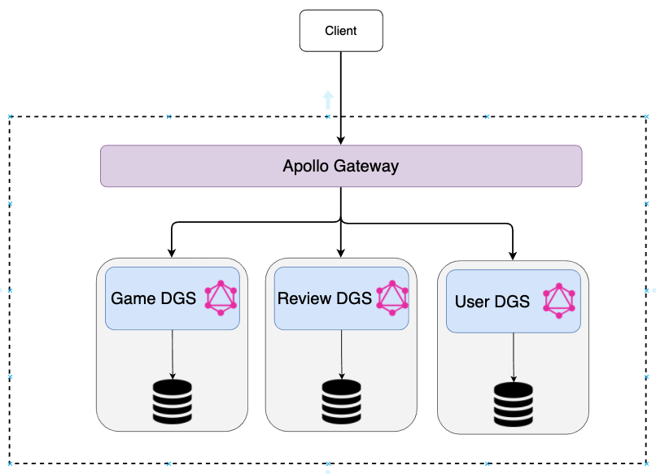

# Game DGS Federation

Demo application of using DGS framework together with Apollo Federation Server.

The repository contains three dgs microservices:

- `game-dgs`: Spring Boot GraphQL service providing the federated `Game` type.
- `user-dgs`: Spring Boot GraphQL service providing the federated `User` type.
- `review-dgs`: Spring Boot GraphQL service extending `Game` and `User` type with `Review`.

And a `apollo-gateway` acting as the Federated Gateway connecting the three microservices.

The image below summarize the relation between them:


## How to Run

1. Start `game-dgs` by running the Spring Boot app from an IDE or `mvn spring-boot:run`.
2. Start `user-dgs` by running the Spring Boot app from an IDE or `mvn spring-boot:run`.
3. Start `review-dgs` by running the Spring Boot app from an IDE or `mvn spring-boot:run`.
4. Run `npm install` in `apollo-gateway` and then `npm run server`.
5. Open http://localhost:4000 in the GraphQL Playground.

## Example Queries

The following federated queries should work when all microservices are up:

```graphql
{
  games {
    name
    releaseYear
    reviews {
      comment
      starRating
    }
  }
}
```

```graphql
{
  users {
    username
    reviews {
      comment
      starRating
    }
  }
}
```

```graphql
{
  reviews {
    comment
    starRating
    game {
      name
    }
    user {
      username
    }
  }
}
```

## References

- [Apollo Federation](https://www.apollographql.com/docs/federation/)
- [DGS Framework](https://netflix.github.io/dgs/)

---

Made by [Lucas Reis](https://github.com/llucasreis)